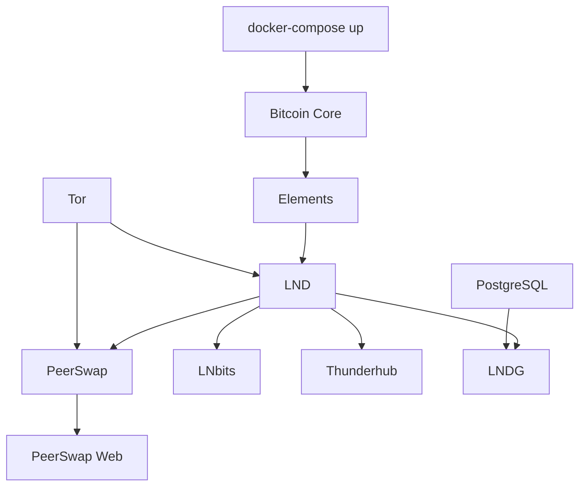

# � Guia de Contribuição - BRLN Full Auto Container Stack

> **Guia técnico completo para desenvolvedores e colaboradores do projeto BRLN Full Auto Container Stack**

## � Visão Geral

O **BRLN Full Auto Container Stack** é uma plataforma de containerização Docker que orquestra um ecossistema completo Bitcoin e Lightning Network. Este guia fornece toda a informação necessária para contribuir efetivamente com o projeto.

### 🏗️ Arquitetura do Sistema

O projeto utiliza uma arquitetura de microserviços containerizados com Docker Compose, oferecendo:

- **Modularidade**: Cada serviço roda em seu próprio container
- **Escalabilidade**: Fácil adição de novos serviços
- **Isolamento**: Separação clara entre componentes
- **Orquestração**: Gerenciamento centralizado via Docker Compose
- **Persistência**: Volumes Docker para dados críticos

## 📁 Estrutura Detalhada do Projeto

```
brlnfullauto/
├── container/                    # 🐳 STACK PRINCIPAL DOCKER
│   ├── docker-compose.yml       # Orquestração de todos os serviços
│   ├── setup-docker-smartsystem.sh  # Setup inicial do ambiente
│   │
│   ├── bitcoin/                 # 🟠 Bitcoin Core
│   │   ├── Dockerfile.bitcoin   # Imagem customizada Bitcoin
│   │   ├── bitcoin.conf         # Configuração do nó Bitcoin
│   │   ├── bitcoin.sh          # Script de inicialização
│   │   └── service.json        # Metadados do serviço
│   │
│   ├── elements/               # 💧 Elements (Liquid Network)
│   │   ├── Dockerfile.elements
│   │   ├── elements.conf
│   │   ├── elements.sh
│   │   └── service.json
│   │
│   ├── lnd/                    # ⚡ Lightning Network Daemon
│   │   ├── Dockerfile.lnd
│   │   ├── entrypoint.sh       # Script avançado de inicialização
│   │   ├── lnd.conf
│   │   ├── password.txt        # Senha para desbloqueio automático
│   │   ├── toggle_on.sh        # Scripts de controle
│   │   ├── toggle_off.sh
│   │   └── service.json
│   │
│   ├── lnbits/                 # 💳 Sistema Bancário LN
│   │   ├── Dockerfile.lnbits
│   │   ├── entrypoint.sh
│   │   └── service.json
│   │
│   ├── lndg/                   # 📊 Dashboard LND
│   │   ├── Dockerfile.lndg
│   │   ├── entrypoint.sh
│   │   ├── lndg.conf.example
│   │   ├── README.md
│   │   └── test-docker.sh
│   │
│   ├── thunderhub/             # 🌩️ Interface Web LND
│   │   ├── service.json
│   │   └── thunderhub.sh
│   │
│   ├── peerswap/               # 🔄 Swaps BTC/Liquid
│   │   ├── Dockerfile.peerswap
│   │   ├── peerswap.conf
│   │   └── service.json
│   │
│   ├── psweb/                  # 🌐 Interface Web PeerSwap
│   │   ├── Dockerfile.psweb
│   │   ├── entrypoint.sh
│   │   ├── pswebconfig.json.example
│   │   └── README.md
│   │
│   ├── tor/                    # 🧅 Proxy Tor
│   │   ├── Dockerfile.tor
│   │   ├── service.json
│   │   └── tor_hs.sh
│   │
│   ├── monitoring/             # 📈 Observabilidade
│   │   ├── prometheus.yml
│   │   ├── loki-config.yml
│   │   ├── promtail-config.yml
│   │   └── dashboards/
│   │
│   ├── graphics/               # 🎨 Interface Web Legada
│   │   ├── interface.sh
│   │   ├── update_interface.sh
│   │   └── html/
│   │
│   ├── logs/                   # 📝 Gestão de Logs
│   │   ├── docker-log-manager.sh
│   │   ├── docker-log-manager.service
│   │   └── install-log-manager.sh
│   │
│   └── bos/                    # 🔧 Balance of Satoshis
│       ├── balance_of_satoshis.sh
│       └── bos_telegram.sh
│
├── CHANGELOG.md                # 📋 Histórico de mudanças
├── CONTRIBUTING.md             # 📖 Este arquivo
├── LICENSE                     # ⚖️ Licença MIT
└── README.md                   # 📚 Documentação principal
```

## 🚀 Ambiente de Desenvolvimento

### 📋 Pré-requisitos

#### Sistema Operacional
- **Linux**: Ubuntu 20.04+ (recomendado), Debian 11+, ou similar
- **macOS**: 10.15+ com Docker Desktop
- **Windows**: WSL2 com Ubuntu (para desenvolvimento)

#### Software Necessário
```bash
# Docker e Docker Compose
curl -fsSL https://get.docker.com -o get-docker.sh
sudo sh get-docker.sh
sudo usermod -aG docker $USER

# Docker Compose (se não incluído)
sudo apt-get update && sudo apt-get install docker-compose-plugin

# Ferramentas de desenvolvimento
sudo apt-get install git jq curl wget
```

### 🔧 Configuração Inicial

#### 1. Clone e Configuração
```bash
# Clone o repositório
git clone https://github.com/[usuario]/brlnfullauto.git
cd brlnfullauto

# Torne scripts executáveis
find container/ -name "*.sh" -exec chmod +x {} \;
```

#### 2. Configuração de Desenvolvimento
```bash
# Copie arquivos de exemplo para desenvolvimento
cd container/
cp lnd/lnd.conf.example lnd/lnd.conf
cp elements/elements.conf.example elements/elements.conf
cp psweb/pswebconfig.json.example psweb/pswebconfig.json

# Configure para modo testnet (recomendado para desenvolvimento)
sed -i 's/bitcoin.mainnet=1/bitcoin.testnet=1/' lnd/lnd.conf
sed -i 's/chain=main/chain=test/' elements/elements.conf
```

#### 3. Build e Teste Inicial
```bash
# Build de todas as imagens
docker-compose build

# Teste com serviços básicos
docker-compose up -d bitcoin elements

# Verifique logs
docker-compose logs -f
```

## 🏛️ Arquitetura de Serviços

### 🔄 Fluxo de Inicialização



### 📊 Dependências entre Serviços

| Serviço | Dependências | Descrição |
|---------|--------------|-----------|
| Bitcoin | - | Nó base da rede Bitcoin |
| Elements | - | Nó independente Liquid |
| LND | Bitcoin | Lightning sobre Bitcoin |
| PeerSwap | LND, Elements | Swaps entre redes |
| LNbits | LND | Interface bancária |
| Thunderhub | LND | Dashboard completo |
| LNDG | LND, PostgreSQL | Estatísticas avançadas |
| PeerSwap Web | PeerSwap | Interface web swaps |
| Tor | - | Proxy para privacidade |

### 🌐 Rede e Comunicação

#### Redes Docker Internas
```yaml
networks:
  bitcoin-net:     # Rede principal Bitcoin/LND
  liquid-net:      # Rede Elements/PeerSwap
  monitoring-net:  # Rede de monitoramento
  grafana-net:     # Rede específica Grafana/LNDG
```

#### Portas e Endpoints
```bash
# Portas internas (container-to-container)
8332  # Bitcoin RPC
18884 # Elements RPC
10009 # LND gRPC
10010 # LND REST
42069 # PeerSwap

# Portas expostas (host)
8889  # LNDG Dashboard
3000  # Thunderhub
5000  # LNbits
1984  # PeerSwap Web
```
        done

        # Rotaciona caracteres de spinner e emojis
        local spin_char="${spinstr:j:1}"
        j=$(( (j + 1) % 4 ))
        count=$(( (count + 1) % (max + 1) ))

        # Atualiza a linha atual com feedback visual
        printf "\r\033[KInstalando seu BRLN bolt...${YELLOW}%s${NC} ${CYAN}[%s]${NC}" "$emoji" "$spin_char"
        sleep "$delay"
    done

    wait "$pid"
    exit_code=$?

    tput cnorm  # Restaura o cursor
    # Exibe mensagem de sucesso ou erro
}
```

## 🛠️ Guia de Desenvolvimento

### 🐳 Adicionando um Novo Serviço

Para adicionar um novo serviço ao stack:

#### 1. Estrutura de Diretório
```bash
# Crie o diretório do novo serviço
mkdir container/novo_servico/

# Estrutura recomendada:
container/novo_servico/
├── Dockerfile.novo_servico    # Imagem customizada
├── entrypoint.sh             # Script de inicialização
├── novo_servico.conf         # Configurações
├── service.json              # Metadados do serviço
└── README.md                 # Documentação específica
```

#### 2. Dockerfile Padrão
```dockerfile
# container/novo_servico/Dockerfile.novo_servico
FROM ubuntu:22.04

# Labels obrigatórias
LABEL maintainer="BRLN Full Auto <contato@brlnfullauto.com>"
LABEL description="Novo Serviço para BRLN Stack"
LABEL version="1.0.0"

# Instalação de dependências
RUN apt-get update && apt-get install -y \
    curl \
    wget \
    && rm -rf /var/lib/apt/lists/*

# Usuário não-root
RUN groupadd -r novoservico && useradd -r -g novoservico novoservico

# Diretórios de trabalho
WORKDIR /app
RUN mkdir -p /data/novoservico && chown novoservico:novoservico /data/novoservico

# Copiar arquivos
COPY entrypoint.sh /app/
COPY novo_servico.conf /app/

# Permissões
RUN chmod +x /app/entrypoint.sh

# Usuário final
USER novoservico

# Health check
HEALTHCHECK --interval=30s --timeout=10s --start-period=60s --retries=3 \
    CMD curl -f http://localhost:8080/health || exit 1

# Comando padrão
ENTRYPOINT ["/app/entrypoint.sh"]
```

#### 3. Script de Inicialização
```bash
#!/bin/bash
# container/novo_servico/entrypoint.sh

set -euo pipefail

# Cores para logs
RED='\033[0;31m'
GREEN='\033[0;32m'
YELLOW='\033[1;33m'
NC='\033[0m'

# Função de log
log() {
    echo -e "${GREEN}[$(date '+%Y-%m-%d %H:%M:%S')] NovoServico: $1${NC}"
}

error() {
    echo -e "${RED}[$(date '+%Y-%m-%d %H:%M:%S')] NovoServico ERROR: $1${NC}" >&2
}

warning() {
    echo -e "${YELLOW}[$(date '+%Y-%m-%d %H:%M:%S')] NovoServico WARNING: $1${NC}"
}

# Verificar dependências
check_dependencies() {
    log "Verificando dependências..."
    
    # Aguardar serviço dependente
    while ! nc -z lnd 10009; do
        log "Aguardando LND..."
        sleep 5
    done
    
    log "Dependências verificadas ✓"
}

# Configuração inicial
setup_service() {
    log "Configurando serviço..."
    
    # Verificar se configuração existe
    if [[ ! -f "/data/novoservico/config.json" ]]; then
        log "Criando configuração inicial..."
        cp /app/novo_servico.conf /data/novoservico/config.json
    fi
    
    log "Configuração concluída ✓"
}

# Função principal
main() {
    log "=== Iniciando Novo Serviço ==="
    
    check_dependencies
    setup_service
    
    log "Serviço iniciado com sucesso!"
    
    # Manter container em execução
    exec "$@"
}

# Trap para cleanup
trap 'log "Parando serviço..."; exit 0' SIGTERM SIGINT

# Executar função principal
main "$@"
```

#### 4. Arquivo service.json
```json
{
  "name": "novo_servico",
  "description": "Descrição do novo serviço",
  "version": "1.0.0",
  "category": "management",
  "dependencies": ["lnd"],
  "ports": {
    "web": 8080,
    "api": 8081
  },
  "volumes": [
    "/data/novoservico"
  ],
  "healthcheck": {
    "endpoint": "/health",
    "interval": "30s"
  },
  "documentation": "https://docs.novoservico.com"
}
```

#### 5. Adicionar ao Docker Compose
```yaml
# Adicionar ao docker-compose.yml
  novo_servico:
    build:
      context: .
      dockerfile: novo_servico/Dockerfile.novo_servico
    container_name: novo_servico
    restart: unless-stopped
    depends_on:
      - lnd
    ports:
      - "8080:8080"
    volumes:
      - novo_servico_data:/data/novoservico
    networks:
      - bitcoin-net
    environment:
      - LND_HOST=lnd:10009
    healthcheck:
      test: ["CMD", "curl", "-f", "http://localhost:8080/health"]
      interval: 30s
      timeout: 10s
      retries: 3
      start_period: 60s

# Adicionar volume
volumes:
  novo_servico_data:
    driver: local
```

### 🔧 Padrões de Desenvolvimento

#### Estrutura de Logs
```bash
# Padrão de logs para todos os serviços
log_format() {
    local level=$1
    local message=$2
    local timestamp=$(date '+%Y-%m-%d %H:%M:%S')
    local service_name=${SERVICE_NAME:-"unknown"}
    
    echo "[$timestamp] [$level] [$service_name] $message"
}

# Exemplos de uso
log_format "INFO" "Serviço iniciado"
log_format "ERROR" "Falha na conexão"
log_format "WARNING" "Configuração não encontrada"
```

#### Health Checks Obrigatórios
```bash
# Todo serviço deve implementar health check
health_check() {
    local service_port=${1:-8080}
    
    # Verificar se o serviço responde
    if curl -f -s "http://localhost:$service_port/health" > /dev/null; then
        return 0
    else
        return 1
    fi
}
```

#### Gestão de Configuração
```bash
# Padrão para carregar configurações
load_config() {
    local config_file="/data/${SERVICE_NAME}/config.json"
    
    if [[ -f "$config_file" ]]; then
        # Carregar configuração existente
        source <(jq -r 'to_entries[] | "export \(.key)=\(.value)"' "$config_file")
    else
        # Criar configuração padrão
        create_default_config "$config_file"
    fi
}
```

### 🧪 Testes e Qualidade

#### Testes Automatizados
```bash
# Script de teste para novos serviços
# container/novo_servico/test-docker.sh

#!/bin/bash
set -e

echo "=== Teste do Novo Serviço ==="

# Verificar se o Dockerfile existe
if [[ ! -f "novo_servico/Dockerfile.novo_servico" ]]; then
    echo "❌ Dockerfile não encontrado"
    exit 1
fi
echo "✅ Dockerfile encontrado"

# Build da imagem
echo "🔨 Construindo imagem..."
docker build -f novo_servico/Dockerfile.novo_servico -t novo_servico:test .

# Verificar configuração no docker-compose
echo "🔍 Verificando configuração..."
if docker-compose config | grep -q "novo_servico"; then
    echo "✅ Configuração no docker-compose encontrada"
else
    echo "❌ Configuração no docker-compose não encontrada"
    exit 1
fi

# Teste de inicialização
echo "🚀 Testando inicialização..."
docker-compose up -d novo_servico
sleep 10

# Verificar se o container está saudável
if docker-compose ps novo_servico | grep -q "healthy"; then
    echo "✅ Container está saudável"
else
    echo "❌ Container não está saudável"
    docker-compose logs novo_servico
    exit 1
fi

# Cleanup
docker-compose down novo_servico
docker rmi novo_servico:test

echo "✅ Todos os testes passaram!"
```

#### Linting e Formatação
```bash
# Verificar scripts bash
shellcheck container/*/entrypoint.sh
shellcheck container/*/*.sh

# Verificar arquivos Docker
hadolint container/*/Dockerfile.*

# Verificar formato JSON
jq . container/*/service.json > /dev/null
```

## 📊 Monitoramento e Observabilidade

### 🔍 Logging Estruturado

Todos os serviços devem implementar logging estruturado:

```bash
# Exemplo de logging JSON
log_json() {
    local level=$1
    local message=$2
    local service=${SERVICE_NAME:-"unknown"}
    
    echo "{\"timestamp\":\"$(date -u '+%Y-%m-%dT%H:%M:%SZ')\",\"level\":\"$level\",\"service\":\"$service\",\"message\":\"$message\"}"
}

# Uso
log_json "INFO" "Serviço iniciado"
log_json "ERROR" "Falha na conexão com LND"
```

### 📈 Métricas e Health Checks

#### Endpoint de Health Check
```bash
# Implementar endpoint /health em todos os serviços
health_endpoint() {
    local status="healthy"
    local checks=()
    
    # Verificar conectividade com dependências
    if ! nc -z lnd 10009; then
        status="unhealthy"
        checks+=("lnd_connection:failed")
    else
        checks+=("lnd_connection:ok")
    fi
    
    # Verificar recursos locais
    if [[ ! -f "/data/novoservico/config.json" ]]; then
        status="unhealthy"
        checks+=("config_file:missing")
    else
        checks+=("config_file:ok")
    fi
    
    # Resposta JSON
    echo "{\"status\":\"$status\",\"checks\":[\"$(IFS=','; echo "${checks[*]}")\"]}"
}
```

### 📋 Troubleshooting

#### Debugging de Containers
```bash
# Verificar logs em tempo real
docker-compose logs -f novo_servico

# Acessar container para debugging
docker exec -it novo_servico /bin/bash

# Verificar recursos do container
docker stats novo_servico

# Inspecionar configuração
docker inspect novo_servico
```

#### Problemas Comuns
```bash
# Container não inicia
docker-compose up novo_servico  # Sem -d para ver logs

# Problemas de rede
docker network ls
docker network inspect container_bitcoin-net

# Problemas de volume
docker volume ls
docker volume inspect container_novo_servico_data
```

## 🚀 Deployment e CI/CD

### 🔄 Pipeline de Integração

#### GitHub Actions (exemplo)
```yaml
# .github/workflows/test.yml
name: Test Container Stack

on:
  push:
    branches: [ main, develop ]
  pull_request:
    branches: [ main ]

jobs:
  test:
    runs-on: ubuntu-latest
    steps:
    - uses: actions/checkout@v3
    
    - name: Setup Docker
      uses: docker/setup-buildx-action@v2
    
    - name: Lint Dockerfiles
      run: |
        docker run --rm -i hadolint/hadolint < container/bitcoin/Dockerfile.bitcoin
        docker run --rm -i hadolint/hadolint < container/lnd/Dockerfile.lnd
    
    - name: Build Images
      run: |
        cd container
        docker-compose build
    
    - name: Test Services
      run: |
        cd container
        docker-compose up -d bitcoin elements
        sleep 30
        docker-compose ps
        docker-compose logs
        docker-compose down
```

### 📦 Versionamento e Releases

#### Semantic Versioning
```bash
# Estrutura de versão: MAJOR.MINOR.PATCH
# Exemplo: 1.2.3

# MAJOR: Mudanças incompatíveis
# MINOR: Novas funcionalidades compatíveis
# PATCH: Correções de bugs
```

#### Tags de Release
```bash
# Criar tag de release
git tag -a v1.2.3 -m "Release v1.2.3: Adiciona novo serviço XYZ"
git push origin v1.2.3

# Gerar changelog automaticamente
conventional-changelog -p angular -i CHANGELOG.md -s
```

## 🤝 Contribuindo

### 📋 Processo de Contribuição

1. **Fork** o repositório
2. **Crie uma branch** para sua funcionalidade:
   ```bash
   git checkout -b feature/nova-funcionalidade
   ```
3. **Implemente** suas alterações seguindo os padrões do projeto
4. **Teste** exaustivamente:
   ```bash
   cd container
   ./test-all-services.sh
   ```
5. **Commit** suas alterações:
   ```bash
   git commit -m "feat: adiciona suporte ao novo serviço XYZ"
   ```
6. **Push** para sua branch:
   ```bash
   git push origin feature/nova-funcionalidade
   ```
7. **Abra um Pull Request**

### 📝 Diretrizes para Pull Requests

#### Checklist Obrigatório
- [ ] Código testado em ambiente local
- [ ] Documentação atualizada
- [ ] Testes automatizados passando
- [ ] Dockerfile segue padrões do projeto
- [ ] Health checks implementados
- [ ] Logging estruturado implementado
- [ ] Arquivo service.json criado
- [ ] README.md do serviço criado

#### Padrões de Commit
```bash
# Usar conventional commits
feat: adiciona novo serviço de monitoramento
fix: corrige problema de inicialização do LND
docs: atualiza documentação do PeerSwap
style: formata código bash
refactor: reorganiza estrutura de diretórios
test: adiciona testes para novo serviço
chore: atualiza versão do Docker
```

### 🐛 Reportando Bugs

#### Template de Bug Report
```markdown
## Descrição do Bug
Descrição clara e concisa do problema.

## Passos para Reproduzir
1. Execute `docker-compose up -d`
2. Acesse interface web
3. Clique em botão X
4. Veja o erro

## Comportamento Esperado
Descreva o que deveria acontecer.

## Logs
```bash
# Cole os logs relevantes aqui
docker-compose logs serviço_com_problema
```

## Ambiente
- OS: Ubuntu 22.04
- Docker: 24.0.0
- Docker Compose: 2.20.0
- Branch: main
- Commit: abc123
```

## 📚 Recursos Adicionais

### 📖 Documentação de Referência
- [Docker Best Practices](https://docs.docker.com/develop/dev-best-practices/)
- [Docker Compose Reference](https://docs.docker.com/compose/compose-file/)
- [Bitcoin Core RPC Documentation](https://bitcoin.org/en/developer-reference#remote-procedure-calls-rpcs)
- [LND API Documentation](https://api.lightning.community/)
- [Elements API Documentation](https://elementsproject.org/elements-code-tutorial/)

### 🛠️ Ferramentas de Desenvolvimento
- [Visual Studio Code](https://code.visualstudio.com/) com extensões Docker
- [Docker Desktop](https://www.docker.com/products/docker-desktop) para desenvolvimento local
- [Postman](https://www.postman.com/) para testes de API
- [jq](https://stedolan.github.io/jq/) para manipulação de JSON

### 🔗 Comunidade e Suporte
- [Issues do GitHub](https://github.com/[usuario]/brlnfullauto/issues)
- [Discussions do GitHub](https://github.com/[usuario]/brlnfullauto/discussions)
- [Discord da Comunidade](https://discord.gg/brlnfullauto)
- [Telegram](https://t.me/brlnfullauto)

## ⚖️ Licença e Responsabilidade

### 📄 Licença MIT
Este projeto está licenciado sob a Licença MIT. Veja o arquivo [LICENSE](./LICENSE) para detalhes completos.

### ⚠️ Aviso de Responsabilidade
- **Uso por conta e risco**: Os desenvolvedores não são responsáveis por perdas de fundos
- **Ambiente de teste**: Sempre teste em testnet antes de usar com fundos reais
- **Código em desenvolvimento**: Este é um projeto open source em desenvolvimento ativo
- **Segurança**: Mantenha sempre backups seguros de suas seeds e configurações

---

**Última atualização**: {{ date }}
**Versão do documento**: 2.0.0
