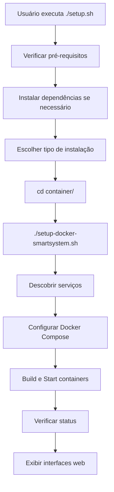

# Scripts do Projeto BRLN Full Auto

Este documento esclarece a função de cada script no projeto.

## 📋 Visão Geral dos Scripts

### 🚀 `/setup.sh` (Script Principal - **USE ESTE**)
**Localização**: Raiz do projeto  
**Função**: Script de instalação simplificado para usuários finais  
**Quando usar**: Primeira instalação ou quando quiser uma experiência guiada

```bash
./setup.sh
```

**O que faz**:
- ✅ Verifica pré-requisitos (Docker, Docker Compose, espaço em disco)
- ✅ Instala dependências automaticamente se necessário
- ✅ Oferece opções de instalação (completa, personalizada, documentação)
- ✅ Chama o `setup-docker-smartsystem.sh` com os parâmetros corretos
- ✅ Exibe informações importantes sobre interfaces web e comandos úteis

### 🐳 `/container/setup-docker-smartsystem.sh` (Motor Principal)
**Localização**: `container/`  
**Função**: Script inteligente que configura e orquestra os containers Docker  
**Quando usar**: Diretamente para configurações avançadas ou automação

```bash
cd container/
./setup-docker-smartsystem.sh
```

**O que faz**:
- 🔍 Descobre automaticamente serviços através dos arquivos `service.json`
- 🎯 Permite seleção específica de serviços
- 📊 Gerencia dependências entre serviços
- 🐳 Constrói e inicia containers Docker
- 📋 Monitora status e saúde dos serviços

**O que faz**:
- 📦 Oferece instalação global do executável
- ⚠️ **Nota**: Este é um projeto experimental, use o `setup-docker-smartsystem.sh` para produção

## 🎯 Qual Script Usar?

### Para Usuários Finais (Recomendado)
```bash
# Instalação simples e guiada
./setup.sh
```

### Para Administradores/DevOps
```bash
# Controle total sobre a instalação
cd container/
./setup-docker-smartsystem.sh
```

## 🔄 Fluxo de Execução



## 📁 Estrutura de Arquivos

```
brlnfullauto/
├── setup.sh                    # 🚀 Script principal (USE ESTE)
├── install -> setup.sh         # 🔗 Symlink para setup.sh
├── README.md                   # 📚 Documentação principal
└── container/
    ├── setup-docker-smartsystem.sh  # 🐳 Motor de configuração Docker
    ├── docker-compose.yml           # 🐳 Orquestração dos serviços
    └── */service.json               # 📋 Configuração de cada serviço
```

## 🚨 Importante

- **Para instalação normal**: Use `./setup.sh` na raiz do projeto
- **Para configuração avançada**: Use `./setup-docker-smartsystem.sh` em `container/`

## 📞 Suporte

Se tiver problemas:
1. Tente primeiro `./setup.sh`
2. Liste os containers com `docker ps`
2. Se não funcionar, verifique logs com `docker-compose logs <nome_do_container>`

Se precisar de ajuda, envie um email para suporte@pagcoin.org
